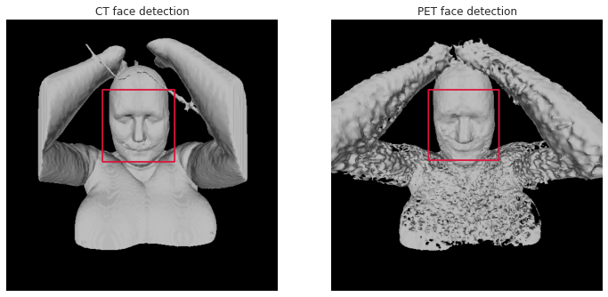
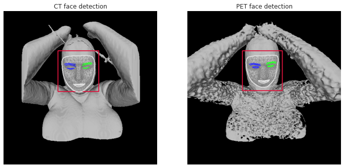

# De-anonymization through face recognition on PET data &middot; 

It is fairly well known that CT and MRI scans, though de-identified, can potentially be re-identified by reconstructing the faces of the patients and using powerful facial recognition software. This is a privacy and security hazard as many public datasets have provided de-identified patient scans without adequately modifying patient facial features to avoid potential breaches. Although this is changing with specific 'de-facing' software now being provided for CT and MRI scans, the issue remains largely unexplored for PET scans. At first, it seems that due to the inherent lower resolution of PET imaging there might be no problem to address as any facial reconstruction will be too noisy to exploit.

In this repository, we explore the potential methods that might be employed to try and de-anonymize pet images through morphological reconstruction and face recognition. We will compare results to those obtained with the associated CT scans.

## Installation

### Getting started
Create a virtual environment using your [favorite method](https://conda.io/projects/conda/en/latest/user-guide/tasks/manage-environments.html#creating-an-environment-with-commands) (venv, conda, etc...) but make sure to install the dependencies using the provided environment.yml file.
If you feel like using conda `conda env create -f environment.yml` should do the trick. Note that most of the code was run remotely using Colab, so you don't necessarily need to run a local install, you can just access the notebooks directly on Colab.

### Download datasets
Follow instruction details [here](https://wiki.cancerimagingarchive.net/pages/viewpage.action?pageId=93258287#932582870c7caa21e8b840a393398eeda1279f3b). Note that there is a substantial amount of data (~350Gb of data) so make sure you have enough space.

### System requirements
Most of the code here was run on Colab, any working python installation >=3.8 should do the trick.

## Experiments
TODO
### File details
TODO
